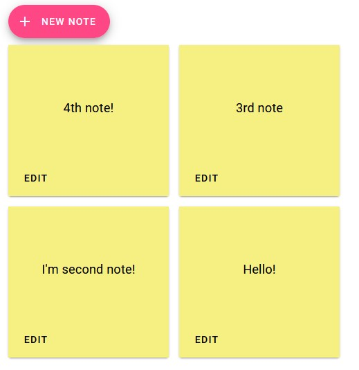

# PostIT Frontend

This Angular 17 application serves as Frontend for PostIT Backend.

### How to start

Run `ng serve`. Navigate to `http://localhost:4200/`.

Alternatively, you can use provided Dockerfile - forward port 4200.

### Requirements

1. Node 20
2. Angular CLI v. 17
3. Running PostIT Backend
